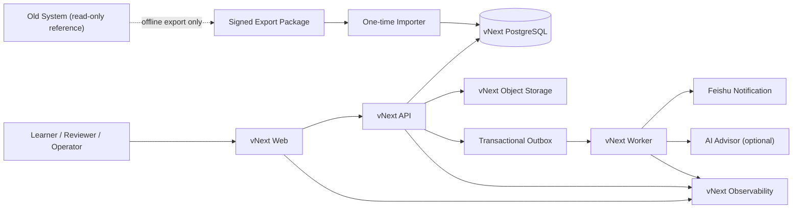

# 06｜系统架构与 ADR

状态：`APPROVED_FOR_BUILD`  
版本：V0.1  
日期：2026-07-20  
文档 Owner：Tech Lead  
批准方案：独立仓库内的模块化单体；前端、API、worker 分进程部署；独立 PostgreSQL 与对象存储。`DEC-005` 已批准。

## 1. 架构目标

1. 物理上与旧系统无依赖；
2. 用最少组件交付完整业务闭环；
3. 一个业务事实只有一个 Owner；
4. 同步核心事务与异步副作用分离；
5. 能从空环境、空数据库重复部署；
6. 能定位每次请求、命令、事件和发布；
7. 不为未来空间、微服务或兼容路径提前造框架。

## 2. 已批准拓扑



旧系统与 vNext 之间没有在线箭头。一次性导入器只接受固定数据包。

## 3. 进程与职责

| 组件 | 职责 | 禁止 |
| --- | --- | --- |
| Web | 路由、渲染、表单交互、BFF/同源代理（如需要） | 本地业务状态机、直连数据库、旧 API fallback |
| API | 身份授权、领域命令、查询、事务、审计、outbox | 同步等待通知/AI；任意 status PATCH |
| Worker | outbox 消费、通知、AI 建议、重试与告警 | 改写人工结论；绕过领域服务 |
| PostgreSQL | 唯一业务事实、约束、事务、outbox | 与旧库共享 schema/role/migration |
| Object Storage | 附件和导入包 | 公开永久 URL；沿用旧 bucket |
| Importer | 验证离线包并写入显式 import command | 连接旧生产库；静默修正歧义 |

## 4. 代码组织

若采用单仓库，建议结构：

```text
apps/
  web/
  api/
  worker/
packages-or-modules/
  contracts/
  identity/
  enrollment/
  learning_work/
  review/
  outcome/
  notification/
  governance/
infra/
  compose/
  deployment/
  observability/
docs/
tests/
```

具体语言可调整，但依赖方向必须固定：

```text
UI/Transport → Application Commands/Queries → Domain → Persistence Ports
Worker → Application Commands/Queries
Infrastructure → implements Domain/Application ports
Domain → 不依赖 Web、ORM、第三方 SDK 或旧系统
```

模块不能通过读取对方数据库表建立隐式耦合；跨模块通过应用接口和明确事务编排。

## 5. 已批准技术栈

使用团队已掌握、但在新仓库重新初始化的技术：

| 层 | 已批准选择 | 选择理由 | 后续验证 |
| --- | --- | --- | --- |
| Web | Next.js 16.2.10 + React 19.2.4 + TypeScript 5.9.x | 团队熟悉、SSR/路由/表单成熟 | 不引入旧 registry/adapter；独立 bundle |
| API | FastAPI 0.139.2 + Python 3.14 | 契约清晰、测试与领域开发效率高 | 模块边界、事务、类型与 OpenAPI |
| DB | PostgreSQL 18 | 事务、约束、JSON 辅助字段、成熟运维 | 独立实例/role；连接池与备份 |
| Migration | Alembic 1.18.5（从 0001） | 与 FastAPI/SQLAlchemy 配套 | 禁止复制旧迁移 |
| Storage | S3-compatible | 短时 URL、生命周期与隔离 bucket | 病毒/类型检查方案 |
| Tests | Pytest + Playwright | 领域、API、真实浏览器覆盖 | 控制 harness 大小与运行时长 |
| Delivery | 容器 + 独立 CI/CD | 可重复、可签名、环境一致 | 具体平台与受限发布身份 |

选择同栈只是降低学习成本，不授权复制旧实现。改变该栈必须更新 `DEC-005` 并用原型数据说明原因。

## 6. ADR 清单

### ADR-001｜项目类型：Greenfield Replacement

- 决定：新系统物理独立，旧系统只读参考和离线导出。
- 原因：兼容式增量重构已经导致多代运行时混合。
- 代价：需要独立环境和显式导入；短期重复搭建基础设施。
- 状态：已批准。

### ADR-002｜架构形态：模块化单体

- 决定：P0 不拆微服务；Web、API、Worker 分进程，业务模块同一后端代码库。
- 原因：当前规模的核心风险是边界混乱而非独立扩缩容；分布式系统会增加失败模式。
- 退出条件：明确团队独立所有权、负载/隔离需求或部署节奏冲突，并有测量证据。
- 状态：已批准。

### ADR-003｜服务端权威

- 决定：浏览器只持有展示/草稿状态；业务状态、allowed commands、版本和权限来自 API。
- 代价：离线体验受限，需要设计冲突恢复。
- 状态：已批准。

### ADR-004｜事务 Outbox

- 决定：核心写入与 outbox 同事务；通知、AI、分析异步。
- 原因：第三方失败不能回滚人工业务事实。
- 状态：已批准。

### ADR-005｜API 优先与共享合同

- 决定：OpenAPI/JSON Schema 是前后端合同；客户端类型由合同生成或验证，禁止复制手写两份不一致类型。
- 状态：已批准。

### ADR-006｜无通用插件/空间框架

- 决定：P0 只实现探索营闭环；不预建 Space Registry、Action Registry、Route Registry、Guild Package 运行时。
- 退出条件：第二个真实业务域完成 discovery，并证明至少两个稳定重复模式。
- 状态：已批准。

### ADR-007｜配置版本化

- 决定：任务和 Rubric 作为发布后不可变版本；在途 Assignment 固定引用原版本。
- 状态：已批准。

### ADR-008｜兼容只在系统外部

- 决定：旧域名/入口切换由 DNS/网关/公告处理；vNext 核心代码不包含 legacy route 和旧状态适配。
- 状态：已批准。

## 7. 非功能预算

`DEC-013` 已批准以下 P0 初始预算；实测不满足时必须更新决策，不得静默放宽：

- 常规 API 读取和核心同步命令在正常试点负载下 p95 ≤ 1 秒；文件上传除外；
- 同步命令不等待飞书/AI；
- Web 首屏不加载全量历史或运营数据；
- 单个前端业务组件超过约 400 行、后端应用服务超过约 500 行时必须审查职责，但不机械拆分；
- 单个验收 harness 不应承载多个领域全矩阵；用共享小型 runner + 领域场景文件；
- 合并门禁提供快速层（目标 ≤ 10 分钟）和发布层；不把所有环境检查串成日常开发唯一反馈。

性能基准与试点 SLO 证据在 G4/G5 生成。

## 8. 可观测性

每个请求/命令/事件至少携带：

- `request_id` / trace id；
- actor、organization、resource（脱敏/最小化）；
- release revision；
- command/event type；
- result/error code；
- latency；
- idempotency replay 标志；
- outbox/notification 状态。

仪表盘最小覆盖：请求成功率/延迟、登录、Current Action、提交、评审、结果、outbox backlog、通知失败、权限拒绝、数据库/存储健康。告警必须有 Owner 和处置动作。

## 9. 故障隔离

| 故障 | 预期行为 |
| --- | --- |
| AI 不可用 | 不阻断人工评审；显示建议不可用 |
| 飞书通知失败 | 业务成功；进入重试/DEAD 告警 |
| 对象存储失败 | 阻止依赖附件的提交；保留文本/草稿 |
| 数据库不可用 | readiness 失败；停止写入；不返回假成功 |
| Worker 停止 | 核心同步流程可继续；outbox backlog 告警 |
| Web 发布失败 | 回滚到上一 vNext Web；API/DB 事实保留 |
| 旧系统完全不可用 | vNext 无影响 |

## 10. 架构验收

- `AT-ARCH-001`：模块依赖扫描无反向/循环依赖；
- `AT-ARCH-002`：旧 repo、旧 API、旧 DB 不可达时全流程通过；
- `AT-ARCH-003`：从空库与空 bucket 启动 test 环境；
- `AT-ARCH-004`：AI/飞书/worker 故障注入符合降级合同；
- `AT-ARCH-005`：发布 revision 可贯穿 Web/API/Worker/日志；
- `AT-ARCH-006`：无 V1/V2/legacy 运行时代码和产品路由；
- `AT-ARCH-007`：快速门禁与发布门禁分层，失败归属清楚。
